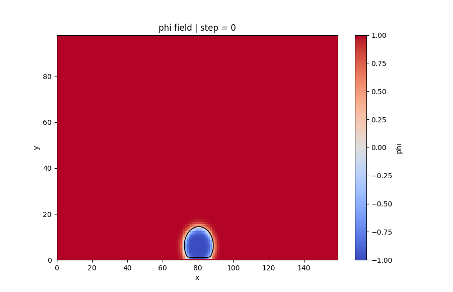
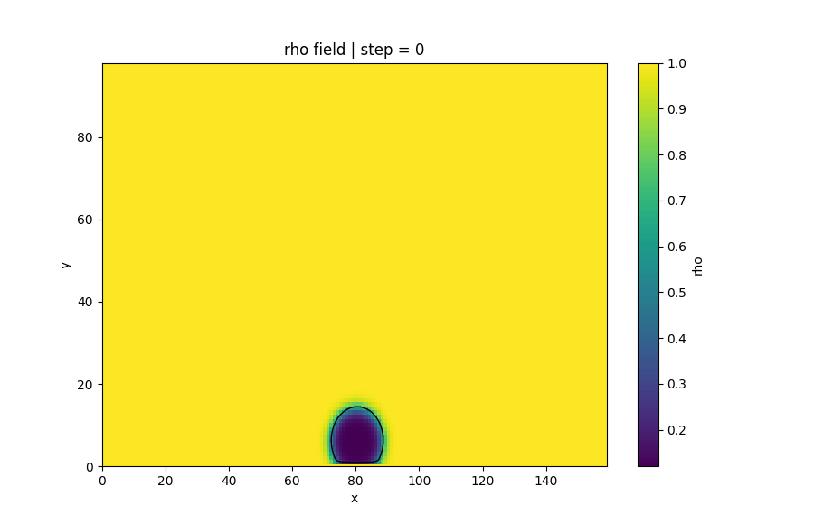
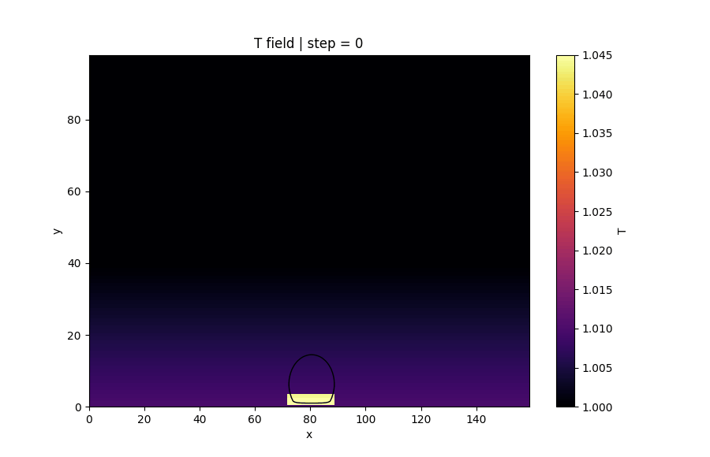
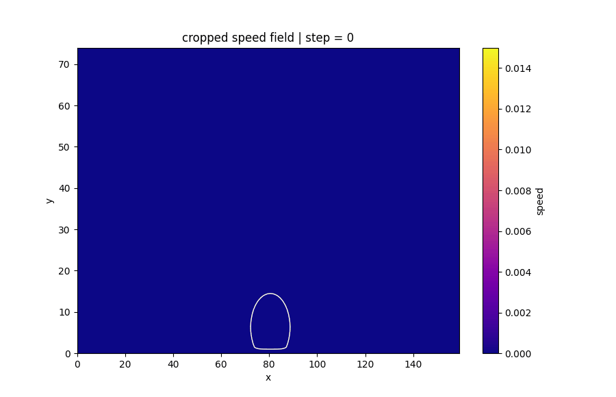
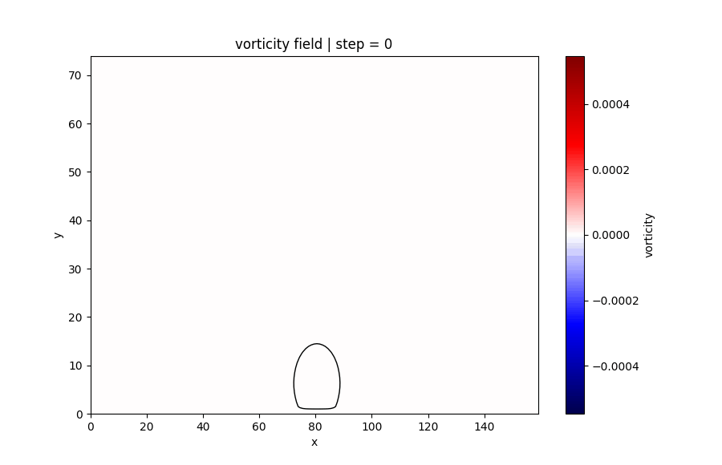
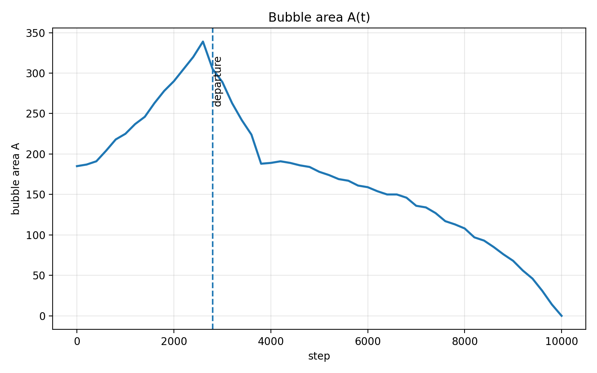
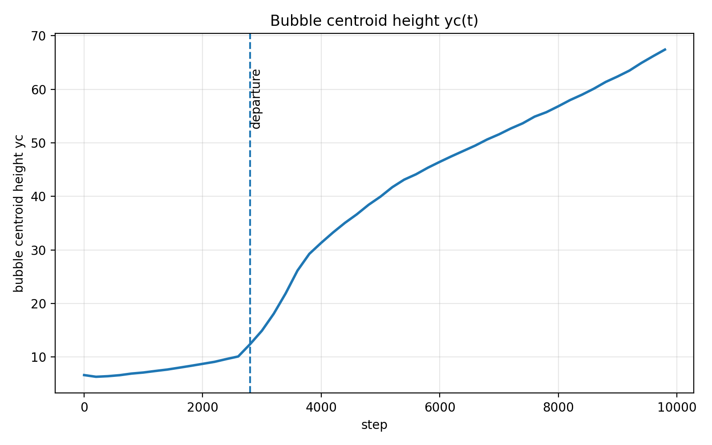
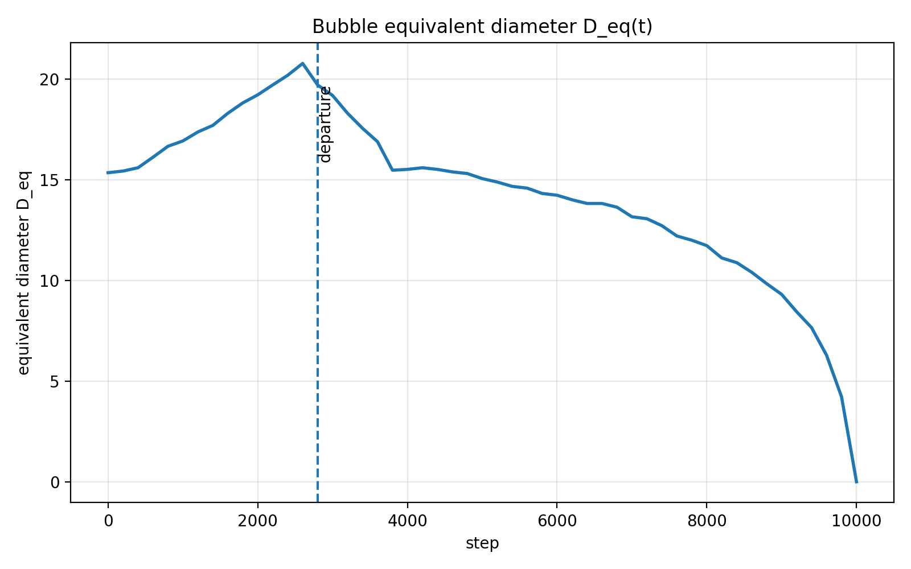
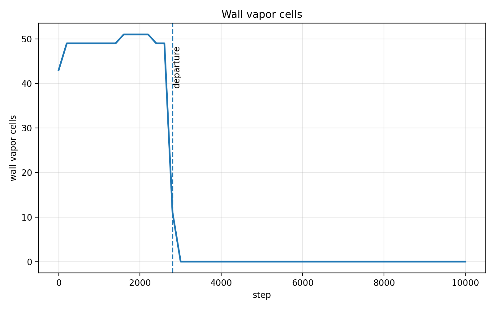
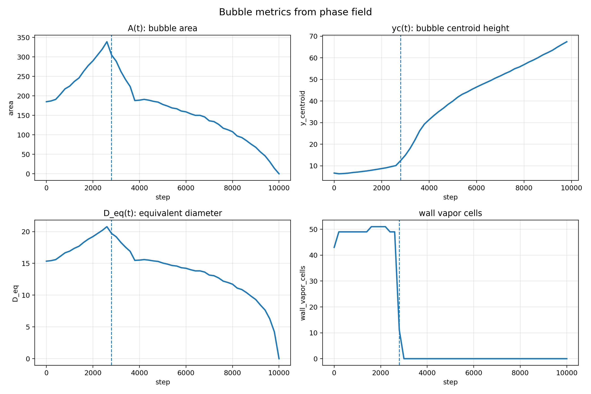

# 🔥 Pool Boiling LBM – 池沸腾单气泡脱落的格子 Boltzmann 模拟

[](https://isocpp.org/)
[]()
[]()
[]()

本项目实现了一个二维池沸腾单气泡脱落过程的格子 Boltzmann 方法（Lattice Boltzmann Method, LBM）模拟。模型采用 D2Q9-BGK 流场求解，并耦合相场变量 `phi`、温度场 `T` 和速度场 `u`，用于展示加热壁面上气泡的生成、生长、脱落、上升、冷凝缩小以及壁面再润湿等典型池沸腾现象。

当前算例采用 `160 × 100` 小网格，目标是快速、稳定地复现池沸腾单气泡的主要物理过程，并输出可用于后处理分析的 CSV 数据。

---

## 📖 目录
- [预期目标](#预期目标)
- [🧠 物理模型](#-物理模型)
- [🧮 数值方法](#-数值方法)
- [⏱ 阶段控制策略](#-阶段控制策略)
- [🧱 边界条件](#-边界条件)
- [📂 代码结构](#-代码结构)
- [⚙️ 参数说明](#️-参数说明)
- [🚀 运行与输出](#-运行与输出)
- [🎬 后处理与可视化](#-后处理与可视化)
- [📈 定量指标分析](#-定量指标分析)
- [✅ 结果现象说明](#-结果现象说明)
- [📊 当前结果评价](#-当前结果评价)
- [⚠️ 注意事项](#️-注意事项)
- [🔧 后续优化方向](#-后续优化方向)
- [📌 推荐展示顺序](#-推荐展示顺序)
- [📚 参考文献](#-参考文献)
- [📜 许可证](#-许可证)

---

## 预期目标

本模拟主要展示池沸腾中的单气泡演化过程：

```text
壁面初始气泡核
→ 底部加热导致气泡生长
→ 泡颈拉伸
→ 气泡脱落
→ 脱落气泡上升
→ 后期气泡逐渐冷凝缩小
→ 壁面再润湿
```

该过程对应池沸腾单气泡脱落中的核心物理现象，包括成核、生长、断颈、脱落、上升、冷凝以及壁面液体回补。

---

## 🧠 物理模型

本项目模拟二维池沸腾中单气泡在加热壁面上的生成、生长、脱落、上升和冷凝缩小过程。模型主要耦合以下物理场：

| 变量 | 含义 |
|---|---|
| `phi` | 相场变量，用于区分气相和液相 |
| `T` | 温度场 |
| `ux, uy` | 流体速度场 |
| `rho` | 由相场变量映射得到的可视化密度 |
| `rho_lbm` | 由 LBM 分布函数求和得到的原始流体密度 |

相场变量定义为：

$$
\phi =
\begin{cases}
1, & \text{液相} \\
-1, & \text{气相} \\
0, & \text{气液界面}
\end{cases}
$$

气泡界面通过 `phi = 0` 的等值线表示。

### 1. 相场模型

本代码使用相场变量 `phi` 描述气液两相分布。液相区域对应 `phi ≈ 1`，气相区域对应 `phi ≈ -1`，气液界面处 `phi` 在二者之间平滑过渡。

界面指示函数定义为：

$$
I(\phi) = 1 - \phi^2
$$

该函数在气液界面附近最大，在纯气相和纯液相区域趋近于 0，因此可用于限制蒸发、冷凝、潜热冷却和界面相关项主要发生在气液界面附近。

相场演化方程中包含以下贡献：

$$
\phi^{n+1}=\phi^n+S_{\mathrm{adv}}+S_{\mathrm{AC}}+S_{\mathrm{evap}}+S_{\mathrm{cond}}+S_{\mathrm{rewet}}+S_{\mathrm{stem}}
$$

其中：

| 符号 | 对应代码项 | 中文含义 |
|---|---|---|
| $\phi^{n+1}$ | `phi_new` | 下一时间步相场变量 |
| $\phi^n$ | `phi` | 当前时间步相场变量 |
| $S_{\mathrm{adv}}$ | `advection` | 对流输运项，表示速度场对气泡界面的搬运 |
| $S_{\mathrm{AC}}$ | `Allen-Cahn interface term` | Allen-Cahn 界面恢复项，用于保持界面平滑 |
| $S_{\mathrm{evap}}$ | `evaporation` | 蒸发项，使液相向气相转化，促进气泡生长 |
| $S_{\mathrm{cond}}$ | `condensation` | 冷凝项，使气相向液相转化，促进气泡缩小 |
| $S_{\mathrm{rewet}}$ | `neck rewetting` | 泡颈再润湿项，促进气泡脱落后液体回补壁面 |
| $S_{\mathrm{stem}}$ | `stem suppression` | 汽柱抑制项，防止壁面残留细长气柱 |


### 2. 温度驱动相变模型

模型设定饱和温度：

```cpp
constexpr double T_SAT = 1.0;
```

局部温度高于饱和温度时，气泡倾向于蒸发增长；局部温度低于饱和温度时，气泡倾向于冷凝缩小：

$$
\begin{cases}
T > T_{\mathrm{sat}}, & \text{蒸发增强} \\
T < T_{\mathrm{sat}}, & \text{冷凝增强} \\
T = T_{\mathrm{sat}}, & \text{处于饱和状态}
\end{cases}
$$

近壁面加热区蒸发项主要用于驱动气泡生长：

```cpp
if (y <= EVAP_HEIGHT && dx_center <= HEATER_LATERAL_HALF_WIDTH)
{
    evaporation = -evap_rate * superheat * I *
                  (near_wall ? wall_boost : 1.0);
}
```

其中：

$$
\Delta T_{\mathrm{sup}}=\max \left(0,\ T - \left(T_{\mathrm{sat}} + \Delta T_0\right) \right)
$$
$$
\Delta T_0 = 0.010
$$

冷凝项根据局部过冷度计算：


$$
\Delta T_{\mathrm{sub}}=\max \left(0,\ T_{\mathrm{sat}} - T \right)
$$


冷凝强度随高度和相区进行修正，用于控制脱落气泡后期逐渐缩小。

### 3. 温度场模型

温度场采用扩散、对流和潜热冷却共同演化：

$$
T^{n+1}=T^n+D_T \nabla^2 T^n-C_T \left( T^n - T_{\mathrm{upwind}}^n \right)-Q_L
$$

其中，热扩散项为：

$$
D_T \nabla^2 T^n
$$

温度对流项根据局部速度方向采用迎风格式近似：

$$
-C_T \left( T^n - T_{\mathrm{upwind}}^n \right)
$$

潜热冷却项为：

$$
Q_L=L_c\max \left(0, T_{\mathrm{sat}} - T^n \right)I(\phi)
$$

主要温度参数如下：

| 参数 | 当前值 | 含义 |
|---|---:|---|
| `T_SAT` | 1.0 | 饱和温度 |
| `T_WALL` | 1.010 | 底部加热壁面温度 |
| `T_TOP` | 0.985 | 顶部冷边界温度 |
| `THERMAL_DIFF` | 0.045 | 热扩散系数 |
| `THERMAL_ADV` | 0.018 | 温度对流系数 |
| `LATENT_COOLING` | 0.016 | 潜热冷却强度 |

底部中心设置局部高温热斑，用于表示活性成核点：

$$
T(x,y)=
\begin{cases}
T_{\mathrm{wall}} + 0.090, & y = 1,\ |x-x_n| \leq w_h \\
T_{\mathrm{wall}} + 0.058, & y = 2,\ |x-x_n| \leq w_h \\
T_{\mathrm{wall}} + 0.034, & y = 3,\ |x-x_n| \leq w_h \\
T_{\mathrm{wall}}, & y = 1,\ |x-x_n| > w_h
\end{cases}
$$

其中， $x_n$ 为成核中心位置， $w_h$ 为局部热斑半宽度。

因此，在温度场动画中，底部中心区域出现高亮是正常现象，表示局部加热壁面和气泡成核区域。

### 4. 流场模型

流场采用 D2Q9 格子 Boltzmann 方法，碰撞模型为 BGK 格式。

平衡分布函数为：
$$f_i^{eq} = \omega_i \rho \bigl(1 + 3 e_i \cdot u + \frac{9}{2}(e_i \cdot u)^2 - \frac{3}{2}u^2\bigr)$$  

| 符号 | 含义 |
|---|---|
| `f_i` | 第 `i` 个方向的分布函数 |
| `w_i` | D2Q9 权重 |
| `e_i` | D2Q9 离散速度 |
| `rho` | 流体密度 |
| `u` | 宏观速度 |

碰撞和迁移过程为：

$$
f_i* = f_i - omega(f_i - f_i^eq) + F_i
$$

其中：

```cpp
omega = 1.0 / TAU
```

当前流场参数为：

| 参数 | 当前值 | 含义 |
|---|---:|---|
| `RHO0` | 1.0 | 基准密度 |
| `TAU` | 0.78 | 松弛时间 |
| `OMEGA` | `1 / TAU` | 碰撞频率 |
| `VMAX` | 0.10 | 最大速度限制 |

### 5. 表面张力模型

代码通过相场梯度和曲率近似构造表面张力：

$$
\nabla \phi =
\left(
\frac{\partial \phi}{\partial x},
\frac{\partial \phi}{\partial y}
\right)
$$

$$
\kappa_{\text{proxy}} = -\nabla^2 \phi
$$

其中：

$$
\nabla^2 \phi =
\frac{\partial^2 \phi}{\partial x^2}
+
\frac{\partial^2 \phi}{\partial y^2}
$$

表面张力力项为：

$$
\mathbf{F}_{s}=\sigma \kappa_{\text{proxy}} \nabla \phi
$$

对应代码形式为：

```cpp
Fx = SURFACE_TENSION * curvature_proxy * gradx;
Fy = SURFACE_TENSION * curvature_proxy * grady;
```

当前表面张力系数为：

```cpp
constexpr double SURFACE_TENSION = 8.6e-4;
```

该项用于维持气泡界面形状，使气泡在生长和上升过程中保持较稳定的圆滑边界。

### 6. 浮力模型

气泡上升主要由浮力项驱动。代码中通过气相体积分数近似构造浮力：

$$
\alpha_v=\frac{1-\phi}{2}
$$

当 `phi ≈ -1` 时，`vapor_fraction ≈ 1`，表示气相区域；当 `phi ≈ 1` 时，`vapor_fraction ≈ 0`，表示液相区域。

浮力项写入 y 方向力：

```cpp
Fy += buoyancy * vapor_fraction;
```

浮力强度根据模拟阶段不同而变化：

| 阶段 | 参数 | 当前值 | 作用 |
|---|---|---:|---|
| 生长阶段 | `BUOYANCY_GROWTH` | `2.4e-5` | 避免气泡过早脱离壁面 |
| 断颈阶段 | `BUOYANCY_PINCH` | `5.2e-5` | 促进气泡上部抬升和泡颈拉细 |
| 上升阶段 | `BUOYANCY_RISE` | `2.5e-5` | 控制脱落气泡上升速度 |

### 7. 可视化密度模型

代码输出的 `rho` 是由相场变量 `phi` 映射得到的可视化密度，用于展示气液区域：

```cpp
rho_phase =
    0.5 * (RHO_LIQUID_VIEW + RHO_VAPOR_VIEW)
  + 0.5 * (RHO_LIQUID_VIEW - RHO_VAPOR_VIEW) * phi;
```

其中：

$$
\rho_{\mathrm{view}}=\frac{\rho_l+\rho_v}{2}+\frac{\rho_l-\rho_v}{2}\phi
$$


$$
\rho_l = 1.0
$$

$$
\rho_v = 0.12
$$

因此：

$$
\phi = 1
\Rightarrow
\rho_{\mathrm{view}} = \rho_l = 1.0
$$

$$
\phi = -1
\Rightarrow
\rho_{\mathrm{view}} = \rho_v = 0.12
$$

其中，$\rho_l$ 表示液相可视化密度，$\rho_v$ 表示气相可视化密度。

需要注意的是，`rho` 主要用于可视化气液分布；`rho_lbm` 是由 LBM 分布函数求和得到的原始流体密度。

---

## 🧮 数值方法

### 1. 宏观速度恢复

每个格点的密度和动量由分布函数求和得到：

$$
\rho = \sum_i f_i
$$

$$
j_x = \sum_i f_i e_{ix}
$$

$$
j_y = \sum_i f_i e_{iy}
$$


速度为：

$$
u_x = \frac{j_x}{\rho}
$$

$$
u_y = \frac{j_y}{\rho}
$$

为了保证数值稳定，速度会被限制在：

$$
u_x, u_y \in [-U_{\max}, U_{\max}]
$$
$$
U_{\max} = \texttt{VMAX}
$$
其中：

```cpp
VMAX = 0.10
```

### 2. 温度更新

温度场更新包含扩散、对流和潜热冷却：

$$
T^{n+1}=T^n+D_T \nabla^2 T^n-C_T \left( T^n - T_{\mathrm{upwind}}^n \right)-L_c \max \left(0,\ T_{\mathrm{sat}} - T^n \right) I(\phi)
$$
其中：

$$
D_T = \texttt{THERMAL\_DIFF}
$$

$$
C_T = \texttt{THERMAL\_ADV}
$$

$$
L_c = \texttt{LATENT\_COOLING}
$$

$$
I(\phi)=1-\phi^2
$$
底部壁面保持加热温度，顶部保持低温边界：

$$
T_{\mathrm{wall}} = 1.010
$$

$$
T_{\mathrm{top}} = 0.985
$$

底部中心热斑在每一步都会重新施加，以保持稳定加热。

### 3. 相场更新

相场更新形式为：

$$
\phi^{n+1}=\mathrm{clip}\left(\phi^n+S_{\mathrm{adv}}+S_{\mathrm{AC}}+S_{\mathrm{evap}}+S_{\mathrm{cond}}+S_{\mathrm{rewet}}+S_{\mathrm{stem}},-1,\ 1\right)
$$

其中：

| 符号 | 对应代码项 | 含义 |
|---|---|---|
| $\phi^{n+1}$ | `phi_new` | 下一时间步相场变量 |
| $\phi^n$ | `phi` | 当前时间步相场变量 |
| $S_{\mathrm{adv}}$ | `adv` | 对流输运项 |
| $S_{\mathrm{AC}}$ | `ac` | Allen-Cahn 界面恢复项 |
| $S_{\mathrm{evap}}$ | `evaporation` | 蒸发项 |
| $S_{\mathrm{cond}}$ | `condensation` | 冷凝项 |
| $S_{\mathrm{rewet}}$ | `neck_rewetting` | 泡颈再润湿项 |
| $S_{\mathrm{stem}}$ | `stem_suppression` | 汽柱抑制项 |
### 4. 碰撞与迁移

流场采用标准 LBM 碰撞迁移：

$$
f_i^{*}=f_i-\Omega\left(f_i - f_i^{eq}\right)+F_i
$$

其中：

| 符号 | 对应代码项 | 含义 |
|---|---|---|
| $f_i^{*}$ | `post` | 碰撞和受力后的分布函数 |
| $f_i$ | `f` | 当前分布函数 |
| $f_i^{eq}$ | `f_eq` | 平衡分布函数 |
| $\Omega$ | `OMEGA` | 碰撞频率，$\Omega = 1/\tau$ |
| $F_i$ | `force_term` | 外力项，包括表面张力和浮力贡献 |

随后按 D2Q9 速度方向迁移到相邻格点。

底部和固体边界采用反弹处理，顶部采用近似开放 / 重定向处理。

---

## ⏱ 阶段控制策略

为了在 `160 × 100` 小网格中稳定观察完整单气泡池沸腾过程，模型采用三阶段控制策略：

```text
阶段 1：气泡生长阶段
阶段 2：泡颈断裂 / 气泡脱落阶段
阶段 3：脱落气泡上升阶段
```

### 1. 气泡生长阶段

时间范围：

$$
0 \leq n < N_{\mathrm{growth}}
$$

其中：

$$
N_{\mathrm{growth}} = 2600
$$

该阶段目标是让气泡在底部加热壁面上稳定长大。

主要特征：

- 强近壁蒸发；
- 较弱浮力；
- 壁面蒸发增强；
- 气泡贴壁生长。

主要参数：

| 参数 | 当前值 | 作用 |
|---|---:|---|
| `EVAP_GROWTH` | 0.082 | 驱动壁面气泡生长 |
| `BUOYANCY_GROWTH` | `2.4e-5` | 避免气泡过早脱离 |
| `COND_GROWTH` | 0.0028 | 限制异常扩散 |
| `WALL_EVAP_BOOST_GROWTH` | 2.35 | 增强近壁蒸发 |

### 2. 泡颈断裂 / 气泡脱落阶段

时间范围：

$$
N_{\mathrm{growth}} \leq n < N_{\mathrm{pinch}}
$$

其中：

$$
N_{\mathrm{growth}} = 2600
$$

$$
N_{\mathrm{pinch}} = 5200
$$

该阶段目标是让气泡从壁面顺利脱落，避免形成持续气柱。

主要特征：

- 降低蒸发强度；
- 增强浮力；
- 增强冷凝抑制汽柱；
- 加入泡颈再润湿项；
- 加入细汽柱抑制项。

主要参数：

| 参数 | 当前值 | 作用 |
|---|---:|---|
| `EVAP_PINCH` | 0.018 | 降低脱落阶段蒸发 |
| `BUOYANCY_PINCH` | `5.2e-5` | 拉升气泡并促进断颈 |
| `COND_PINCH` | 0.0038 | 抑制壁面细长汽柱 |
| `NECK_REWETTING` | 0.00110 | 促进泡颈处液体回补 |
| `STEM_SUPPRESSION` | 0.00040 | 抑制壁面残留气柱 |

### 3. 脱落气泡上升阶段

时间范围：

$$
n \geq N_{\mathrm{pinch}}
$$

其中：

$$
N_{\mathrm{pinch}} = 5200
$$

该阶段目标是让脱落后的气泡稳定上升，并在后期逐渐缩小。

主要特征：

- 较弱蒸发；
- 较弱冷凝；
- 轻微维持脱落气泡；
- 速度阻尼防止过快冲顶；
- 气泡后期逐渐缩小。

主要参数：

| 参数 | 当前值 | 作用 |
|---|---:|---|
| `EVAP_RISE` | 0.020 | 轻微维持脱落气泡 |
| `COND_RISE` | 0.00030 | 控制后期缩小速度 |
| `BUOYANCY_RISE` | `2.5e-5` | 控制气泡上升速度 |
| `DETACHED_SUPPORT` | 0.0022 | 防止脱落气泡过早消失 |
| `RISE_VELOCITY_DAMPING` | 0.993 | 控制上升速度，避免撞顶 |

---

## 🧱 边界条件

| 边界 | 条件 |
|---|---|
| 左右边界 | 周期边界 |
| 底部边界 | 固体壁面，无滑移，固定加热温度 |
| 顶部边界 | 近似开放 / 固体边界处理，顶部温度固定为冷边界 |
| 底部中心 | 局部高温热斑，作为活性成核点 |
| 相场顶部 | 强制液相，避免气泡直接穿出计算域 |

### 1. 左右周期边界

代码中通过 `px(x)` 函数实现 x 方向周期边界：

```cpp
if (x < 0) return NX - 1;
if (x >= NX) return 0;
```

因此气泡和流场在左右方向上具有周期性。

### 2. 底部加热壁面

底部为固体边界：

```cpp
solid[p] = (y == 0 || y == NY - 1) ? 1 : 0;
```

底部附近温度固定为壁面温度，并在成核点附近叠加局部高温热斑：

$$
T(x,1)=T_{\mathrm{wall}}+\Delta T_1
$$

$$
T(x,2)=T_{\mathrm{wall}}+\Delta T_2
$$

$$
T(x,3)=T_{\mathrm{wall}}+\Delta T_3
$$

其中：

$$
\Delta T_1=\texttt{HEATER\_BOOST\_Y1}
$$

$$
\Delta T_2=\texttt{HEATER\_BOOST\_Y2}
$$

$$
\Delta T_3=\texttt{HEATER\_BOOST\_Y3}
$$

对应当前代码：

$$
\Delta T_1=0.090,\qquad
\Delta T_2=0.058,\qquad
\Delta T_3=0.034
$$

该热斑用于稳定触发气泡生长。

### 3. 顶部冷边界

顶部附近温度固定为：

```cpp
T_TOP = 0.985
```

同时相场顶部强制为液相：

```cpp
phi = PHI_LIQUID
```

这样可以避免气泡直接穿出顶部边界。由于计算域高度较小，顶部边界可能对速度场产生一定影响，因此速度场展示时建议裁剪中下部区域。

---

## 📂 代码结构

类 `PoolBoilingLBM` 的主要函数如下：

| 函数 | 功能 |
|---|---|
| `PoolBoilingLBM()` | 构造函数，分配并初始化数组 |
| `initialize()` | 初始化温度场、相场、速度场和分布函数 |
| `computeVelocity()` | 从分布函数恢复宏观速度 |
| `evolveTemperature()` | 更新温度场 |
| `evolvePhaseField()` | 更新相场变量 |
| `collideAndStream()` | 执行 LBM 碰撞与迁移 |
| `applyBoundaryConditions()` | 应用顶部速度边界处理 |
| `step()` | 推进一个时间步 |
| `writeFieldCSV()` | 输出所有格点数据到 CSV |
| `writeDiagnosticsHeader()` | 输出诊断文件表头 |
| `appendDiagnostics()` | 输出全局诊断量 |

---

## ⚙️ 参数说明

### 1. 基本 LBM 参数

| 参数 | 当前值 | 说明 |
|---|---:|---|
| `RHO0` | 1.0 | 基准密度 |
| `TAU` | 0.78 | 松弛时间 |
| `OMEGA` | `1 / TAU` | 碰撞频率 |
| `VMAX` | 0.10 | 速度上限 |

### 2. 相场参数

| 参数 | 当前值 | 说明 |
|---|---:|---|
| `PHI_LIQUID` | 1.0 | 液相相场值 |
| `MOBILITY` | 0.010 | 相场迁移率 |
| `DETACHED_MOBILITY` | 0.0065 | 脱落后相场迁移率 |
| `EPS2` | 2.18 | 界面厚度相关参数 |
| `SURFACE_TENSION` | `8.6e-4` | 表面张力系数 |

### 3. 温度参数

| 参数 | 当前值 | 说明 |
|---|---:|---|
| `T_SAT` | 1.0 | 饱和温度 |
| `T_WALL` | 1.010 | 底部壁面温度 |
| `T_TOP` | 0.985 | 顶部冷边界温度 |
| `THERMAL_DIFF` | 0.045 | 热扩散系数 |
| `THERMAL_ADV` | 0.018 | 热对流系数 |
| `LATENT_COOLING` | 0.016 | 潜热冷却强度 |
| `TEMP_MIN` | 0.965 | 温度下限 |
| `TEMP_MAX` | 1.155 | 温度上限 |

### 4. 初始气泡与加热区参数

| 参数 | 当前值 | 说明 |
|---|---:|---|
| `NUCLEATION_X` | 80 | 成核点 x 位置 |
| `INITIAL_BUBBLE_RADIUS` | 8.2 | 初始气泡半径 |
| `INITIAL_BUBBLE_Y` | 5.8 | 初始气泡中心高度 |
| `INITIAL_INTERFACE_WIDTH` | 1.7 | 初始界面宽度 |
| `HOT_HALF_WIDTH` | 8 | 局部热斑半宽 |
| `EVAP_HEIGHT` | 12 | 近壁蒸发高度 |
| `HEATER_LATERAL_HALF_WIDTH` | 18 | 蒸发区横向半宽 |

### 5. 阶段时间参数

| 参数 | 当前值 | 说明 |
|---|---:|---|
| `GROWTH_END` | 2600 | 生长阶段结束步 |
| `PINCH_END` | 5200 | 断颈阶段结束步 |
| `RISE_DAMPING_START` | 3600 | 上升速度阻尼开始步 |

### 6. 浮力参数

| 参数 | 当前值 | 说明 |
|---|---:|---|
| `BUOYANCY_GROWTH` | `2.4e-5` | 生长阶段浮力 |
| `BUOYANCY_PINCH` | `5.2e-5` | 断颈阶段浮力 |
| `BUOYANCY_RISE` | `2.5e-5` | 上升阶段浮力 |

### 7. 蒸发与冷凝参数

| 参数 | 当前值 | 说明 |
|---|---:|---|
| `EVAP_GROWTH` | 0.082 | 生长阶段蒸发 |
| `EVAP_PINCH` | 0.018 | 断颈阶段蒸发 |
| `EVAP_RISE` | 0.020 | 上升阶段蒸发 |
| `COND_GROWTH` | 0.0028 | 生长阶段冷凝 |
| `COND_PINCH` | 0.0038 | 断颈阶段冷凝 |
| `COND_RISE` | 0.00030 | 上升阶段冷凝 |

### 8. 脱落气泡维持参数

| 参数 | 当前值 | 说明 |
|---|---:|---|
| `DETACHED_SUPPORT_START` | 3800 | 维持项启动步 |
| `DETACHED_SUPPORT` | 0.0022 | 脱落气泡维持强度 |
| `DETACHED_SUPPORT_Y_MIN` | 12 | 作用最低高度 |
| `DETACHED_SUPPORT_Y_MAX` | 82 | 作用最高高度 |
| `DETACHED_SUPPORT_PHI_LIMIT` | 0.60 | 作用相场阈值 |

### 9. 泡颈与气柱控制参数

| 参数 | 当前值 | 说明 |
|---|---:|---|
| `NECK_ZONE_Y_MIN` | 2 | 泡颈控制区域最低高度 |
| `NECK_ZONE_Y_MAX` | 8 | 泡颈控制区域最高高度 |
| `NECK_HALF_WIDTH` | 11 | 泡颈控制横向半宽 |
| `NECK_REWETTING` | 0.00110 | 泡颈再润湿强度 |
| `STEM_SUPPRESSION` | 0.00040 | 细汽柱抑制强度 |

---

## 🚀 运行与输出

### 1. 编译运行

主程序示例：

```cpp
#include "../inc/PoolBoilingLBM.hpp"

int main()
{
    PoolBoilingLBM sim;

    sim.initialize();
    sim.writeDiagnosticsHeader();

    const int total_steps = 10000;
    const int output_interval = 200;

    for (int step = 0; step <= total_steps; ++step)
    {
        if (step % output_interval == 0)
        {
            sim.writeFieldCSV(step);
            sim.appendDiagnostics(step);
        }

        sim.step();
    }

    return 0;
}
```

建议输出设置：

$$
N_{\mathrm{step}} = 10000
$$

$$
N_{\mathrm{out}} = 200
$$

这样可以得到 51 帧数据，适合制作动画和定量曲线。

### 2. CSV 输出字段

每个 `fields_XXXXXXX.csv` 文件包含：

| 字段 | 说明 |
|---|---|
| `x` | 网格 x 坐标 |
| `y` | 网格 y 坐标 |
| `rho` | 由 `phi` 映射得到的可视化密度 |
| `rho_lbm` | 原始 LBM 密度 |
| `phi` | 相场变量 |
| `T` | 温度 |
| `dx` | x 方向速度 `ux` |
| `dy` | y 方向速度 `uy` |
| `speed` | 速度大小 |
| `solid` | 是否为固体边界 |

### 3. 诊断文件

`diagnostics.csv` 包含：

| 字段 | 说明 |
|---|---|
| `step` | 时间步 |
| `vapor_cells` | 气相格子数 |
| `vapor_centroid_y` | 气泡质心高度 |
| `wall_vapor_cells` | 壁面气相格子数 |
| `mean_temperature` | 平均温度 |
| `max_speed` | 最大速度 |

---

## 🎬 后处理与可视化

<div align="center">

### 物理场动画

| 相场（$\phi$） |
|:---:|
|  |

*相场用于展示气泡形态演化，包括气泡生成、生长、泡颈形成、脱落、上升以及后期缩小。*

<br>

| 密度场（$\rho$） |
|:---:|
|  |

*密度场由相场变量映射得到，用于直观展示气液两相空间分布。高密度区域对应液相，低密度区域对应气相。*

<br>

| 温度场（$T$） |
|:---:|
|  |

*温度场用于展示底部加热壁面、局部高温热斑、热边界层发展以及气泡脱落上升过程中对温度场的扰动。*

<br>

| 速度场（$|\mathbf{u}|$） |
|:---:|
|  |

*速度场用于展示气泡脱落和上升过程中诱导的局部流动。*

<br>

| 涡量场（$\omega$） |
|:---:|
|  |

*涡量场用于展示气泡两侧回流、尾涡结构以及脱落诱导流动。相比单纯速度大小图，涡量场更适合分析气泡周围的流动结构。*

</div>

涡量定义为：

$$
\omega=\frac{\partial v}{\partial x}-\frac{\partial u}{\partial y}
$$

其中：

$$
u = \texttt{dx}
$$

$$
v = \texttt{dy}
$$


---

## 📈 定量指标分析

<div align="center">

### 气泡动力学指标

| 气泡面积 $A(t)$ |
|:---:|
|  |

*气泡面积由满足 `phi < 0` 的气相格子数量计算得到。理想趋势为先增大，在脱落附近达到峰值，随后随冷凝和相场耗散逐渐减小。*

<br>

| 气泡质心高度 $y_c(t)$ |
|:---:|
|  |

*气泡质心高度用于判断气泡是否成功脱落并独立上升。脱落后 $y_c(t)$ 应持续升高。*

<br>

| 等效直径 $D_{eq}(t)$ |
|:---:|
|  |

*二维等效直径由气泡面积换算得到，用于描述气泡生长、脱落和后期缩小过程。*

<br>

| 壁面气相格子数 |
|:---:|
|  |

*壁面气相格子数用于判断气泡脱落后的壁面再润湿现象。气泡脱落后该值应快速下降并接近 0。*

<br>

| 四指标综合图 |
|:---:|
|  |

*综合图同时展示 $A(t)$、$y_c(t)$、$D_{eq}(t)$ 和壁面气相格子数，可用于整体判断气泡生长、脱落、上升、缩小和再润湿过程是否合理。*

</div>

### 指标定义

| 指标 | 定义 | 物理意义 |
|---|---|---|
| $A(t)$ | `number(phi < 0) × dx × dy` | 气泡面积 |
| $y_c(t)$ | `average(y | phi < 0)` | 气泡质心高度 |
| $D_{eq}(t)$ | `sqrt(4A / pi)` | 二维等效直径 |
| `wall_vapor_cells(t)` | `number(phi < 0 and y <= 3)` | 壁面气相格子数 / 再润湿指标 |

### 理想趋势

| 指标 | 合理变化趋势 |
|---|---|
| $A(t)$ | 先增大，脱落附近达到峰值，脱落后逐渐减小 |
| $y_c(t)$ | 贴壁阶段缓慢上升，脱落后持续上升 |
| $D_{eq}(t)$ | 先增大，脱落后逐渐减小 |
| `wall_vapor_cells(t)` | 气泡生长时较高，脱落时快速下降，脱落后接近 0 |

当前结果中，气泡面积和等效直径在达到峰值后逐渐下降，说明气泡经历了生长、脱落和后期冷凝缩小过程；气泡质心高度持续上升，说明气泡成功脱离壁面并独立上升；壁面气相格子数在脱落后快速降为 0，说明壁面发生了明显再润湿。

---

## ✅ 结果现象说明

当前模拟结果可以展示以下池沸腾单气泡过程：

```text
气泡成核
气泡生长
泡颈形成
气泡脱落
气泡上升
壁面再润湿
热羽流形成
气泡诱导流和尾涡
气泡后期缩小
```

从动画和曲线中可以观察到：

1. `phi` 相场显示气泡从壁面中心生成并逐渐长大；
2. 气泡在约 `2600–3000` 步附近开始脱落；
3. `wall_vapor_cells(t)` 快速下降，说明壁面再润湿；
4. `yc(t)` 持续上升，说明气泡脱落后独立上升；
5. `A(t)` 和 `D_eq(t)` 在达到峰值后逐渐下降，说明气泡后期冷凝缩小；
6. 温度场中可见底部热斑和上升热羽流；
7. 速度场中可见气泡诱导流；
8. 涡量场中可见气泡两侧回流和尾涡结构。

---

## 📊 当前结果评价

当前结果已经不仅仅是单个气泡动画，而是形成了完整的数据展示链：

| 结果类型 | 作用 | 评价 |
|---|---|---|
| `phi` 相场 | 气泡形态、生长、脱落、上升 | 良好 |
| `rho` 密度场 | 气液两相分布 | 清楚 |
| `T` 温度场 | 热边界层和热羽流 | 合理 |
| `speed` 速度场 | 气泡诱导流强度 | 可用 |
| `vorticity` 涡量场 | 回流和尾涡结构 | 明显 |
| `A(t)` | 气泡面积演化 | 合理 |
| `yc(t)` | 气泡上升过程 | 明显 |
| `D_eq(t)` | 气泡等效直径变化 | 合理 |
| `wall_vapor_cells(t)` | 壁面再润湿 | 明显 |

综合来看，当前数据可以作为：

- 小网格池沸腾现象展示；
- 代码验证算例；
- 论文前期结果图；
- 课堂或项目汇报结果。

如果用于正式论文主结果，还需要进一步进行网格无关性分析和文献对比。

---

## ⚠️ 注意事项

### 1. 当前模型适合作为小网格现象展示

本算例采用 `160 × 100` 网格，适合快速展示单气泡池沸腾过程。

如果用于正式论文主结果，还需要进行：

- 网格无关性验证；
- 参数敏感性分析；
- 与文献数据对比；
- 脱落直径和脱落周期统计；
- 壁面热流或 Nusselt 数分析。

### 2. `rho` 是可视化密度

输出的 `rho` 是由相场变量 `phi` 映射得到的可视化密度，不应直接解释为严格热多相 LBM 自然演化出的真实密度。

建议表述为：

```text
密度场根据相场变量映射得到，用于表征气液两相分布。
```

### 3. 初始气泡核和局部热斑是人为设定的

为了在小网格中稳定观察单气泡脱落，代码设置了初始气泡核和局部加热热斑。

这在池沸腾单泡数值实验中是常见做法，尤其适合用于验证代码能否稳定复现气泡脱落过程。

### 4. 顶部边界可能影响速度场

由于计算域高度较小，顶部边界可能在速度场中形成一定影响。

展示速度场时建议裁剪中下部区域，例如：

$$
y \leq 75
$$

并结合涡量图分析气泡附近流动结构。

### 5. 阶段控制参数具有演示性质

当前模型采用生长、断颈和上升三个阶段控制参数，用于在小网格中稳定展示完整单气泡过程。

因此，当前算例更适合作为：

- 现象演示；
- 参数调试；
- 代码验证；
- 前期结果展示。

而不是直接作为无调参的严格物理预测模型。

---

## 🔧 后续优化方向

为了进一步提升结果可信度，可以进行以下工作。

### 1. 网格无关性验证

建议比较：

$$
160 \times 100
$$

$$
200 \times 125
$$

$$
240 \times 150
$$

观察以下指标是否趋势一致：

- 气泡脱落时间；
- 气泡峰值面积；
- 脱落直径；
- 质心上升速度；
- 壁面再润湿时间。

### 2. 参数敏感性分析

可以系统改变以下参数：

| 参数 | 主要影响 | 增大后的趋势 |
|---|---|---|
| `EVAP_RISE` | 脱落后气泡的蒸发维持强度 | 气泡存在更久，但过大可能导致气泡持续增大 |
| `COND_RISE` | 脱落后气泡的冷凝强度 | 气泡更快缩小或消失 |
| `BUOYANCY_RISE` | 脱落后气泡的上升速度 | 气泡上升更快，但过大可能导致气泡过早接近顶部边界 |
| `SURFACE_TENSION` | 气液界面稳定性和气泡形状 | 气泡更圆、更稳定，但过大可能影响断颈脱落 |
| `DETACHED_SUPPORT` | 脱落气泡后期维持项 | 气泡寿命延长，但过大可能导致气泡不消失 |
| `NECK_REWETTING` | 泡颈再润湿和断颈过程 | 更容易脱落，但过大可能使断颈显得过于突然 |

观察气泡生长、脱落和上升过程的变化。

### 3. 壁面热流分析

可根据温度梯度计算近似壁面热流：

$$
q_{\mathrm{wall}}=-k\frac{\partial T}{\partial y}
$$

其中，$q_{\mathrm{wall}}$ 为壁面热流密度，$k$ 为导热系数，$T$ 为温度，$y$ 为垂直于壁面的方向。并进一步计算平均换热强度或类 Nusselt 数指标。

### 4. 多气泡扩展

当前模型为单气泡脱落算例。后续可扩展为：

- 多成核点；
- 多气泡合并；
- 气泡群上升；
- 汽柱和干斑形成；
- 临界热流前兆分析。

### 5. 更真实的多相 LBM

如果要进一步提高物理严格性，可以考虑：

- 伪势多相 LBM；
- 自由能多相 LBM；
- 焓法相变模型；
- 真实密度比热相变模型；
- 更严格的接触角边界条件。

---

## 📌 推荐展示顺序

建议在报告或论文前期结果中按以下顺序展示：

1. `phi` 相场动画：展示气泡生成、生长、脱落和上升；
2. `rho` 密度场动画：展示气液两相分布；
3. `T` 温度场动画：展示热边界层和热羽流；
4. `speed` 速度场动画：展示气泡诱导流；
5. `vorticity` 涡量场动画：展示尾涡；
6. `A(t)`、`yc(t)`、`D_eq(t)`、`wall_vapor_cells(t)` 曲线：证明现象合理。

---

## 📚 参考文献

1. Guo, Z., & Shu, C.  
   *Lattice Boltzmann Method and Its Applications in Engineering.*

2. Sukop, M. C., & Thorne, D. T.  
   *Lattice Boltzmann Modeling: An Introduction for Geoscientists and Engineers.*

3. Huang, H., Sukop, M., & Lu, X.  
   *Multiphase Lattice Boltzmann Methods: Theory and Application.*

4. Li, Q., Luo, K. H., Kang, Q. J., He, Y. L., Chen, Q., & Liu, Q.  
   Lattice Boltzmann methods for multiphase flow and phase-change heat transfer.

---

## 📜 许可证

本项目可根据需要采用 MIT License 或课程 / 论文项目内部使用许可。

作者：alexmercer37
项目：Pool Boiling LBM  
版本：160 × 100 single-bubble demonstration  
日期：2026-05-21
项目地址：https://github.com/alexmercer37/LBM-PoolBoiling
该函数在气液界面附近最大，在纯气相和纯液相区域趋近于 0，因此可用于限制蒸发、冷凝、潜热冷却和界面相关项主要发生在气液界面附近。

相场演化方程中包含以下贡献：

$$
\phi^{n+1}=\phi^n+S_{\mathrm{adv}}+S_{\mathrm{AC}}+S_{\mathrm{evap}}+S_{\mathrm{cond}}+S_{\mathrm{rewet}}+S_{\mathrm{stem}}
$$

其中：

| 符号 | 对应代码项 | 中文含义 |
|---|---|---|
| $\phi^{n+1}$ | `phi_new` | 下一时间步相场变量 |
| $\phi^n$ | `phi` | 当前时间步相场变量 |
| $S_{\mathrm{adv}}$ | `advection` | 对流输运项，表示速度场对气泡界面的搬运 |
| $S_{\mathrm{AC}}$ | `Allen-Cahn interface term` | Allen-Cahn 界面恢复项，用于保持界面平滑 |
| $S_{\mathrm{evap}}$ | `evaporation` | 蒸发项，使液相向气相转化，促进气泡生长 |
| $S_{\mathrm{cond}}$ | `condensation` | 冷凝项，使气相向液相转化，促进气泡缩小 |
| $S_{\mathrm{rewet}}$ | `neck rewetting` | 泡颈再润湿项，促进气泡脱落后液体回补壁面 |
| $S_{\mathrm{stem}}$ | `stem suppression` | 汽柱抑制项，防止壁面残留细长气柱 |


### 2. 温度驱动相变模型

模型设定饱和温度：

```cpp
constexpr double T_SAT = 1.0;
```

局部温度高于饱和温度时，气泡倾向于蒸发增长；局部温度低于饱和温度时，气泡倾向于冷凝缩小：

$$
\begin{cases}
T > T_{\mathrm{sat}}, & \text{蒸发增强} \\
T < T_{\mathrm{sat}}, & \text{冷凝增强} \\
T = T_{\mathrm{sat}}, & \text{处于饱和状态}
\end{cases}
$$

近壁面加热区蒸发项主要用于驱动气泡生长：

```cpp
if (y <= EVAP_HEIGHT && dx_center <= HEATER_LATERAL_HALF_WIDTH)
{
    evaporation = -evap_rate * superheat * I *
                  (near_wall ? wall_boost : 1.0);
}
```

其中：

$$
\Delta T_{\mathrm{sup}}
=
\max \left(0,\ T - \left(T_{\mathrm{sat}} + \Delta T_0\right) \right)
$$
$$
\Delta T_0 = 0.010
$$

冷凝项根据局部过冷度计算：


$$
\Delta T_{\mathrm{sub}}
=
\max \left(0,\ T_{\mathrm{sat}} - T \right)
$$


冷凝强度随高度和相区进行修正，用于控制脱落气泡后期逐渐缩小。

### 3. 温度场模型

温度场采用扩散、对流和潜热冷却共同演化：

$$
T^{n+1}
=
T^n
+
D_T \nabla^2 T^n
-
C_T \left( T^n - T_{\mathrm{upwind}}^n \right)
-
Q_L
$$

其中，热扩散项为：

$$
D_T \nabla^2 T^n
$$

温度对流项根据局部速度方向采用迎风格式近似：

$$
- C_T \left( T^n - T_{\mathrm{upwind}}^n \right)
$$

潜热冷却项为：

$$
Q_L
=
L_c
\max \left(0, T_{\mathrm{sat}} - T^n \right)
I(\phi)
$$

主要温度参数如下：

| 参数 | 当前值 | 含义 |
|---|---:|---|
| `T_SAT` | 1.0 | 饱和温度 |
| `T_WALL` | 1.010 | 底部加热壁面温度 |
| `T_TOP` | 0.985 | 顶部冷边界温度 |
| `THERMAL_DIFF` | 0.045 | 热扩散系数 |
| `THERMAL_ADV` | 0.018 | 温度对流系数 |
| `LATENT_COOLING` | 0.016 | 潜热冷却强度 |

底部中心设置局部高温热斑，用于表示活性成核点：

$$
T(x,y)=
\begin{cases}
T_{\mathrm{wall}} + 0.090, & y = 1,\ |x-x_n| \leq w_h \\
T_{\mathrm{wall}} + 0.058, & y = 2,\ |x-x_n| \leq w_h \\
T_{\mathrm{wall}} + 0.034, & y = 3,\ |x-x_n| \leq w_h \\
T_{\mathrm{wall}}, & y = 1,\ |x-x_n| > w_h
\end{cases}
$$

其中，$x_n$ 为成核中心位置，$w_h$ 为局部热斑半宽度。

因此，在温度场动画中，底部中心区域出现高亮是正常现象，表示局部加热壁面和气泡成核区域。

### 4. 流场模型

流场采用 D2Q9 格子 Boltzmann 方法，碰撞模型为 BGK 格式。

平衡分布函数为：
$$
f_i^{eq}=\omega_i\rho(1+3e_i\bullet u+\frac{9}{2}{(e_i\bullet u)}^2-\frac{3}{2}u^2)
$$

| 符号 | 含义 |
|---|---|
| `f_i` | 第 `i` 个方向的分布函数 |
| `w_i` | D2Q9 权重 |
| `e_i` | D2Q9 离散速度 |
| `rho` | 流体密度 |
| `u` | 宏观速度 |

碰撞和迁移过程为：

$$
f_i* = f_i - omega(f_i - f_i^eq) + F_i
$$

其中：

```cpp
omega = 1.0 / TAU
```

当前流场参数为：

| 参数 | 当前值 | 含义 |
|---|---:|---|
| `RHO0` | 1.0 | 基准密度 |
| `TAU` | 0.78 | 松弛时间 |
| `OMEGA` | `1 / TAU` | 碰撞频率 |
| `VMAX` | 0.10 | 最大速度限制 |

### 5. 表面张力模型

代码通过相场梯度和曲率近似构造表面张力：

$$
\nabla \phi =
\left(
\frac{\partial \phi}{\partial x},
\frac{\partial \phi}{\partial y}
\right)
$$

$$
\kappa_{\text{proxy}} = -\nabla^2 \phi
$$

其中：

$$
\nabla^2 \phi =
\frac{\partial^2 \phi}{\partial x^2}
+
\frac{\partial^2 \phi}{\partial y^2}
$$

表面张力力项为：

$$
\mathbf{F}_{s}
=
\sigma \kappa_{\text{proxy}} \nabla \phi
$$

对应代码形式为：

```cpp
Fx = SURFACE_TENSION * curvature_proxy * gradx;
Fy = SURFACE_TENSION * curvature_proxy * grady;
```

当前表面张力系数为：

```cpp
constexpr double SURFACE_TENSION = 8.6e-4;
```

该项用于维持气泡界面形状，使气泡在生长和上升过程中保持较稳定的圆滑边界。

### 6. 浮力模型

气泡上升主要由浮力项驱动。代码中通过气相体积分数近似构造浮力：

$$
\alpha_v
=
\frac{1-\phi}{2}
$$

当 `phi ≈ -1` 时，`vapor_fraction ≈ 1`，表示气相区域；当 `phi ≈ 1` 时，`vapor_fraction ≈ 0`，表示液相区域。

浮力项写入 y 方向力：

```cpp
Fy += buoyancy * vapor_fraction;
```

浮力强度根据模拟阶段不同而变化：

| 阶段 | 参数 | 当前值 | 作用 |
|---|---|---:|---|
| 生长阶段 | `BUOYANCY_GROWTH` | `2.4e-5` | 避免气泡过早脱离壁面 |
| 断颈阶段 | `BUOYANCY_PINCH` | `5.2e-5` | 促进气泡上部抬升和泡颈拉细 |
| 上升阶段 | `BUOYANCY_RISE` | `2.5e-5` | 控制脱落气泡上升速度 |

### 7. 可视化密度模型

代码输出的 `rho` 是由相场变量 `phi` 映射得到的可视化密度，用于展示气液区域：

```cpp
rho_phase =
    0.5 * (RHO_LIQUID_VIEW + RHO_VAPOR_VIEW)
  + 0.5 * (RHO_LIQUID_VIEW - RHO_VAPOR_VIEW) * phi;
```

其中：

$$
\rho_{\mathrm{view}}
=
\frac{\rho_l+\rho_v}{2}
+
\frac{\rho_l-\rho_v}{2}\phi
$$


$$
\rho_l = 1.0
$$

$$
\rho_v = 0.12
$$

因此：

$$
\phi = 1
\Rightarrow
\rho_{\mathrm{view}} = \rho_l = 1.0
$$

$$
\phi = -1
\Rightarrow
\rho_{\mathrm{view}} = \rho_v = 0.12
$$

其中，$\rho_l$ 表示液相可视化密度，$\rho_v$ 表示气相可视化密度。

需要注意的是，`rho` 主要用于可视化气液分布；`rho_lbm` 是由 LBM 分布函数求和得到的原始流体密度。

---

## 🧮 数值方法

### 1. 宏观速度恢复

每个格点的密度和动量由分布函数求和得到：

$$
\rho = \sum_i f_i
$$

$$
j_x = \sum_i f_i e_{ix}
$$

$$
j_y = \sum_i f_i e_{iy}
$$


速度为：

$$
u_x = \frac{j_x}{\rho}
$$

$$
u_y = \frac{j_y}{\rho}
$$

为了保证数值稳定，速度会被限制在：

$$
u_x, u_y \in [-U_{\max}, U_{\max}]
$$
$$
U_{\max} = \texttt{VMAX}
$$
其中：

```cpp
VMAX = 0.10
```

### 2. 温度更新

温度场更新包含扩散、对流和潜热冷却：

$$
T^{n+1}
=
T^n
+
D_T \nabla^2 T^n
-
C_T \left( T^n - T_{\mathrm{upwind}}^n \right)
-
L_c \max \left(0,\ T_{\mathrm{sat}} - T^n \right) I(\phi)
$$
其中：

$$
D_T = \texttt{THERMAL\_DIFF}
$$

$$
C_T = \texttt{THERMAL\_ADV}
$$

$$
L_c = \texttt{LATENT\_COOLING}
$$

$$
I(\phi)=1-\phi^2
$$
底部壁面保持加热温度，顶部保持低温边界：

$$
T_{\mathrm{wall}} = 1.010
$$

$$
T_{\mathrm{top}} = 0.985
$$

底部中心热斑在每一步都会重新施加，以保持稳定加热。

### 3. 相场更新

相场更新形式为：

$$
\phi^{n+1}
=
\mathrm{clip}
\left(
\phi^n
+
S_{\mathrm{adv}}
+
S_{\mathrm{AC}}
+
S_{\mathrm{evap}}
+
S_{\mathrm{cond}}
+
S_{\mathrm{rewet}}
+
S_{\mathrm{stem}},
-1,\ 1
\right)
$$

其中：

| 符号 | 对应代码项 | 含义 |
|---|---|---|
| $\phi^{n+1}$ | `phi_new` | 下一时间步相场变量 |
| $\phi^n$ | `phi` | 当前时间步相场变量 |
| $S_{\mathrm{adv}}$ | `adv` | 对流输运项 |
| $S_{\mathrm{AC}}$ | `ac` | Allen-Cahn 界面恢复项 |
| $S_{\mathrm{evap}}$ | `evaporation` | 蒸发项 |
| $S_{\mathrm{cond}}$ | `condensation` | 冷凝项 |
| $S_{\mathrm{rewet}}$ | `neck_rewetting` | 泡颈再润湿项 |
| $S_{\mathrm{stem}}$ | `stem_suppression` | 汽柱抑制项 |
### 4. 碰撞与迁移

流场采用标准 LBM 碰撞迁移：

$$
f_i^{*}
=
f_i
-
\Omega
\left(
f_i - f_i^{eq}
\right)
+
F_i
$$

其中：

| 符号 | 对应代码项 | 含义 |
|---|---|---|
| $f_i^{*}$ | `post` | 碰撞和受力后的分布函数 |
| $f_i$ | `f` | 当前分布函数 |
| $f_i^{eq}$ | `f_eq` | 平衡分布函数 |
| $\Omega$ | `OMEGA` | 碰撞频率，$\Omega = 1/\tau$ |
| $F_i$ | `force_term` | 外力项，包括表面张力和浮力贡献 |

随后按 D2Q9 速度方向迁移到相邻格点。

底部和固体边界采用反弹处理，顶部采用近似开放 / 重定向处理。

---

## ⏱ 阶段控制策略

为了在 `160 × 100` 小网格中稳定观察完整单气泡池沸腾过程，模型采用三阶段控制策略：

```text
阶段 1：气泡生长阶段
阶段 2：泡颈断裂 / 气泡脱落阶段
阶段 3：脱落气泡上升阶段
```

### 1. 气泡生长阶段

时间范围：

$$
0 \leq n < N_{\mathrm{growth}}
$$

其中：

$$
N_{\mathrm{growth}} = 2600
$$

该阶段目标是让气泡在底部加热壁面上稳定长大。

主要特征：

- 强近壁蒸发；
- 较弱浮力；
- 壁面蒸发增强；
- 气泡贴壁生长。

主要参数：

| 参数 | 当前值 | 作用 |
|---|---:|---|
| `EVAP_GROWTH` | 0.082 | 驱动壁面气泡生长 |
| `BUOYANCY_GROWTH` | `2.4e-5` | 避免气泡过早脱离 |
| `COND_GROWTH` | 0.0028 | 限制异常扩散 |
| `WALL_EVAP_BOOST_GROWTH` | 2.35 | 增强近壁蒸发 |

### 2. 泡颈断裂 / 气泡脱落阶段

时间范围：

$$
N_{\mathrm{growth}} \leq n < N_{\mathrm{pinch}}
$$

其中：

$$
N_{\mathrm{growth}} = 2600
$$

$$
N_{\mathrm{pinch}} = 5200
$$

该阶段目标是让气泡从壁面顺利脱落，避免形成持续气柱。

主要特征：

- 降低蒸发强度；
- 增强浮力；
- 增强冷凝抑制汽柱；
- 加入泡颈再润湿项；
- 加入细汽柱抑制项。

主要参数：

| 参数 | 当前值 | 作用 |
|---|---:|---|
| `EVAP_PINCH` | 0.018 | 降低脱落阶段蒸发 |
| `BUOYANCY_PINCH` | `5.2e-5` | 拉升气泡并促进断颈 |
| `COND_PINCH` | 0.0038 | 抑制壁面细长汽柱 |
| `NECK_REWETTING` | 0.00110 | 促进泡颈处液体回补 |
| `STEM_SUPPRESSION` | 0.00040 | 抑制壁面残留气柱 |

### 3. 脱落气泡上升阶段

时间范围：

$$
n \geq N_{\mathrm{pinch}}
$$

其中：

$$
N_{\mathrm{pinch}} = 5200
$$

该阶段目标是让脱落后的气泡稳定上升，并在后期逐渐缩小。

主要特征：

- 较弱蒸发；
- 较弱冷凝；
- 轻微维持脱落气泡；
- 速度阻尼防止过快冲顶；
- 气泡后期逐渐缩小。

主要参数：

| 参数 | 当前值 | 作用 |
|---|---:|---|
| `EVAP_RISE` | 0.020 | 轻微维持脱落气泡 |
| `COND_RISE` | 0.00030 | 控制后期缩小速度 |
| `BUOYANCY_RISE` | `2.5e-5` | 控制气泡上升速度 |
| `DETACHED_SUPPORT` | 0.0022 | 防止脱落气泡过早消失 |
| `RISE_VELOCITY_DAMPING` | 0.993 | 控制上升速度，避免撞顶 |

---

## 🧱 边界条件

| 边界 | 条件 |
|---|---|
| 左右边界 | 周期边界 |
| 底部边界 | 固体壁面，无滑移，固定加热温度 |
| 顶部边界 | 近似开放 / 固体边界处理，顶部温度固定为冷边界 |
| 底部中心 | 局部高温热斑，作为活性成核点 |
| 相场顶部 | 强制液相，避免气泡直接穿出计算域 |

### 1. 左右周期边界

代码中通过 `px(x)` 函数实现 x 方向周期边界：

```cpp
if (x < 0) return NX - 1;
if (x >= NX) return 0;
```

因此气泡和流场在左右方向上具有周期性。

### 2. 底部加热壁面

底部为固体边界：

```cpp
solid[p] = (y == 0 || y == NY - 1) ? 1 : 0;
```

底部附近温度固定为壁面温度，并在成核点附近叠加局部高温热斑：

$$
T(x,1)=T_{\mathrm{wall}}+\Delta T_1
$$

$$
T(x,2)=T_{\mathrm{wall}}+\Delta T_2
$$

$$
T(x,3)=T_{\mathrm{wall}}+\Delta T_3
$$

其中：

$$
\Delta T_1=\texttt{HEATER\_BOOST\_Y1}
$$

$$
\Delta T_2=\texttt{HEATER\_BOOST\_Y2}
$$

$$
\Delta T_3=\texttt{HEATER\_BOOST\_Y3}
$$

对应当前代码：

$$
\Delta T_1=0.090,\qquad
\Delta T_2=0.058,\qquad
\Delta T_3=0.034
$$

该热斑用于稳定触发气泡生长。

### 3. 顶部冷边界

顶部附近温度固定为：

```cpp
T_TOP = 0.985
```

同时相场顶部强制为液相：

```cpp
phi = PHI_LIQUID
```

这样可以避免气泡直接穿出顶部边界。由于计算域高度较小，顶部边界可能对速度场产生一定影响，因此速度场展示时建议裁剪中下部区域。

---

## 📂 代码结构

类 `PoolBoilingLBM` 的主要函数如下：

| 函数 | 功能 |
|---|---|
| `PoolBoilingLBM()` | 构造函数，分配并初始化数组 |
| `initialize()` | 初始化温度场、相场、速度场和分布函数 |
| `computeVelocity()` | 从分布函数恢复宏观速度 |
| `evolveTemperature()` | 更新温度场 |
| `evolvePhaseField()` | 更新相场变量 |
| `collideAndStream()` | 执行 LBM 碰撞与迁移 |
| `applyBoundaryConditions()` | 应用顶部速度边界处理 |
| `step()` | 推进一个时间步 |
| `writeFieldCSV()` | 输出所有格点数据到 CSV |
| `writeDiagnosticsHeader()` | 输出诊断文件表头 |
| `appendDiagnostics()` | 输出全局诊断量 |

---

## ⚙️ 参数说明

### 1. 基本 LBM 参数

| 参数 | 当前值 | 说明 |
|---|---:|---|
| `RHO0` | 1.0 | 基准密度 |
| `TAU` | 0.78 | 松弛时间 |
| `OMEGA` | `1 / TAU` | 碰撞频率 |
| `VMAX` | 0.10 | 速度上限 |

### 2. 相场参数

| 参数 | 当前值 | 说明 |
|---|---:|---|
| `PHI_LIQUID` | 1.0 | 液相相场值 |
| `MOBILITY` | 0.010 | 相场迁移率 |
| `DETACHED_MOBILITY` | 0.0065 | 脱落后相场迁移率 |
| `EPS2` | 2.18 | 界面厚度相关参数 |
| `SURFACE_TENSION` | `8.6e-4` | 表面张力系数 |

### 3. 温度参数

| 参数 | 当前值 | 说明 |
|---|---:|---|
| `T_SAT` | 1.0 | 饱和温度 |
| `T_WALL` | 1.010 | 底部壁面温度 |
| `T_TOP` | 0.985 | 顶部冷边界温度 |
| `THERMAL_DIFF` | 0.045 | 热扩散系数 |
| `THERMAL_ADV` | 0.018 | 热对流系数 |
| `LATENT_COOLING` | 0.016 | 潜热冷却强度 |
| `TEMP_MIN` | 0.965 | 温度下限 |
| `TEMP_MAX` | 1.155 | 温度上限 |

### 4. 初始气泡与加热区参数

| 参数 | 当前值 | 说明 |
|---|---:|---|
| `NUCLEATION_X` | 80 | 成核点 x 位置 |
| `INITIAL_BUBBLE_RADIUS` | 8.2 | 初始气泡半径 |
| `INITIAL_BUBBLE_Y` | 5.8 | 初始气泡中心高度 |
| `INITIAL_INTERFACE_WIDTH` | 1.7 | 初始界面宽度 |
| `HOT_HALF_WIDTH` | 8 | 局部热斑半宽 |
| `EVAP_HEIGHT` | 12 | 近壁蒸发高度 |
| `HEATER_LATERAL_HALF_WIDTH` | 18 | 蒸发区横向半宽 |

### 5. 阶段时间参数

| 参数 | 当前值 | 说明 |
|---|---:|---|
| `GROWTH_END` | 2600 | 生长阶段结束步 |
| `PINCH_END` | 5200 | 断颈阶段结束步 |
| `RISE_DAMPING_START` | 3600 | 上升速度阻尼开始步 |

### 6. 浮力参数

| 参数 | 当前值 | 说明 |
|---|---:|---|
| `BUOYANCY_GROWTH` | `2.4e-5` | 生长阶段浮力 |
| `BUOYANCY_PINCH` | `5.2e-5` | 断颈阶段浮力 |
| `BUOYANCY_RISE` | `2.5e-5` | 上升阶段浮力 |

### 7. 蒸发与冷凝参数

| 参数 | 当前值 | 说明 |
|---|---:|---|
| `EVAP_GROWTH` | 0.082 | 生长阶段蒸发 |
| `EVAP_PINCH` | 0.018 | 断颈阶段蒸发 |
| `EVAP_RISE` | 0.020 | 上升阶段蒸发 |
| `COND_GROWTH` | 0.0028 | 生长阶段冷凝 |
| `COND_PINCH` | 0.0038 | 断颈阶段冷凝 |
| `COND_RISE` | 0.00030 | 上升阶段冷凝 |

### 8. 脱落气泡维持参数

| 参数 | 当前值 | 说明 |
|---|---:|---|
| `DETACHED_SUPPORT_START` | 3800 | 维持项启动步 |
| `DETACHED_SUPPORT` | 0.0022 | 脱落气泡维持强度 |
| `DETACHED_SUPPORT_Y_MIN` | 12 | 作用最低高度 |
| `DETACHED_SUPPORT_Y_MAX` | 82 | 作用最高高度 |
| `DETACHED_SUPPORT_PHI_LIMIT` | 0.60 | 作用相场阈值 |

### 9. 泡颈与气柱控制参数

| 参数 | 当前值 | 说明 |
|---|---:|---|
| `NECK_ZONE_Y_MIN` | 2 | 泡颈控制区域最低高度 |
| `NECK_ZONE_Y_MAX` | 8 | 泡颈控制区域最高高度 |
| `NECK_HALF_WIDTH` | 11 | 泡颈控制横向半宽 |
| `NECK_REWETTING` | 0.00110 | 泡颈再润湿强度 |
| `STEM_SUPPRESSION` | 0.00040 | 细汽柱抑制强度 |

---

## 🚀 运行与输出

### 1. 编译运行

主程序示例：

```cpp
#include "../inc/PoolBoilingLBM.hpp"

int main()
{
    PoolBoilingLBM sim;

    sim.initialize();
    sim.writeDiagnosticsHeader();

    const int total_steps = 10000;
    const int output_interval = 200;

    for (int step = 0; step <= total_steps; ++step)
    {
        if (step % output_interval == 0)
        {
            sim.writeFieldCSV(step);
            sim.appendDiagnostics(step);
        }

        sim.step();
    }

    return 0;
}
```

建议输出设置：

$$
N_{\mathrm{step}} = 10000
$$

$$
N_{\mathrm{out}} = 200
$$

这样可以得到 51 帧数据，适合制作动画和定量曲线。

### 2. CSV 输出字段

每个 `fields_XXXXXXX.csv` 文件包含：

| 字段 | 说明 |
|---|---|
| `x` | 网格 x 坐标 |
| `y` | 网格 y 坐标 |
| `rho` | 由 `phi` 映射得到的可视化密度 |
| `rho_lbm` | 原始 LBM 密度 |
| `phi` | 相场变量 |
| `T` | 温度 |
| `dx` | x 方向速度 `ux` |
| `dy` | y 方向速度 `uy` |
| `speed` | 速度大小 |
| `solid` | 是否为固体边界 |

### 3. 诊断文件

`diagnostics.csv` 包含：

| 字段 | 说明 |
|---|---|
| `step` | 时间步 |
| `vapor_cells` | 气相格子数 |
| `vapor_centroid_y` | 气泡质心高度 |
| `wall_vapor_cells` | 壁面气相格子数 |
| `mean_temperature` | 平均温度 |
| `max_speed` | 最大速度 |

---

## 🎬 后处理与可视化

<div align="center">

### 物理场动画

| 相场（$\phi$） |
|:---:|
|  |

*相场用于展示气泡形态演化，包括气泡生成、生长、泡颈形成、脱落、上升以及后期缩小。*

<br>

| 密度场（$\rho$） |
|:---:|
|  |

*密度场由相场变量映射得到，用于直观展示气液两相空间分布。高密度区域对应液相，低密度区域对应气相。*

<br>

| 温度场（$T$） |
|:---:|
|  |

*温度场用于展示底部加热壁面、局部高温热斑、热边界层发展以及气泡脱落上升过程中对温度场的扰动。*

<br>

| 速度场（$|\mathbf{u}|$） |
|:---:|
|  |

*速度场用于展示气泡脱落和上升过程中诱导的局部流动。由于顶部边界可能产生速度带，建议展示时裁剪中下部区域，例如 $y \le 75$。*

<br>

| 涡量场（$\omega$） |
|:---:|
|  |

*涡量场用于展示气泡两侧回流、尾涡结构以及脱落诱导流动。相比单纯速度大小图，涡量场更适合分析气泡周围的流动结构。*

</div>

涡量定义为：

$$
\omega
=
\frac{\partial v}{\partial x}
-
\frac{\partial u}{\partial y}
$$

其中：

$$
u = \texttt{dx}
$$

$$
v = \texttt{dy}
$$


---

## 📈 定量指标分析

<div align="center">

### 气泡动力学指标

| 气泡面积 $A(t)$ |
|:---:|
|  |

*气泡面积由满足 `phi < 0` 的气相格子数量计算得到。理想趋势为先增大，在脱落附近达到峰值，随后随冷凝和相场耗散逐渐减小。*

<br>

| 气泡质心高度 $y_c(t)$ |
|:---:|
|  |

*气泡质心高度用于判断气泡是否成功脱落并独立上升。脱落后 $y_c(t)$ 应持续升高。*

<br>

| 等效直径 $D_{eq}(t)$ |
|:---:|
|  |

*二维等效直径由气泡面积换算得到，用于描述气泡生长、脱落和后期缩小过程。*

<br>

| 壁面气相格子数 |
|:---:|
|  |

*壁面气相格子数用于判断气泡脱落后的壁面再润湿现象。气泡脱落后该值应快速下降并接近 0。*

<br>

| 四指标综合图 |
|:---:|
|  |

*综合图同时展示 $A(t)$、$y_c(t)$、$D_{eq}(t)$ 和壁面气相格子数，可用于整体判断气泡生长、脱落、上升、缩小和再润湿过程是否合理。*

</div>

### 指标定义

| 指标 | 定义 | 物理意义 |
|---|---|---|
| $A(t)$ | `number(phi < 0) × dx × dy` | 气泡面积 |
| $y_c(t)$ | `average(y | phi < 0)` | 气泡质心高度 |
| $D_{eq}(t)$ | `sqrt(4A / pi)` | 二维等效直径 |
| `wall_vapor_cells(t)` | `number(phi < 0 and y <= 3)` | 壁面气相格子数 / 再润湿指标 |

### 理想趋势

| 指标 | 合理变化趋势 |
|---|---|
| $A(t)$ | 先增大，脱落附近达到峰值，脱落后逐渐减小 |
| $y_c(t)$ | 贴壁阶段缓慢上升，脱落后持续上升 |
| $D_{eq}(t)$ | 先增大，脱落后逐渐减小 |
| `wall_vapor_cells(t)` | 气泡生长时较高，脱落时快速下降，脱落后接近 0 |

当前结果中，气泡面积和等效直径在达到峰值后逐渐下降，说明气泡经历了生长、脱落和后期冷凝缩小过程；气泡质心高度持续上升，说明气泡成功脱离壁面并独立上升；壁面气相格子数在脱落后快速降为 0，说明壁面发生了明显再润湿。

---

## ✅ 结果现象说明

当前模拟结果可以展示以下池沸腾单气泡过程：

```text
气泡成核
气泡生长
泡颈形成
气泡脱落
气泡上升
壁面再润湿
热羽流形成
气泡诱导流和尾涡
气泡后期缩小
```

从动画和曲线中可以观察到：

1. `phi` 相场显示气泡从壁面中心生成并逐渐长大；
2. 气泡在约 `2600–3000` 步附近开始脱落；
3. `wall_vapor_cells(t)` 快速下降，说明壁面再润湿；
4. `yc(t)` 持续上升，说明气泡脱落后独立上升；
5. `A(t)` 和 `D_eq(t)` 在达到峰值后逐渐下降，说明气泡后期冷凝缩小；
6. 温度场中可见底部热斑和上升热羽流；
7. 速度场中可见气泡诱导流；
8. 涡量场中可见气泡两侧回流和尾涡结构。

---

## 📊 当前结果评价

当前结果已经不仅仅是单个气泡动画，而是形成了完整的数据展示链：

| 结果类型 | 作用 | 评价 |
|---|---|---|
| `phi` 相场 | 气泡形态、生长、脱落、上升 | 良好 |
| `rho` 密度场 | 气液两相分布 | 清楚 |
| `T` 温度场 | 热边界层和热羽流 | 合理 |
| `speed` 速度场 | 气泡诱导流强度 | 可用 |
| `vorticity` 涡量场 | 回流和尾涡结构 | 明显 |
| `A(t)` | 气泡面积演化 | 合理 |
| `yc(t)` | 气泡上升过程 | 明显 |
| `D_eq(t)` | 气泡等效直径变化 | 合理 |
| `wall_vapor_cells(t)` | 壁面再润湿 | 明显 |

综合来看，当前数据可以作为：

- 小网格池沸腾现象展示；
- 代码验证算例；
- 论文前期结果图；
- 课堂或项目汇报结果。

如果用于正式论文主结果，还需要进一步进行网格无关性分析和文献对比。

---

## ⚠️ 注意事项

### 1. 当前模型适合作为小网格现象展示

本算例采用 `160 × 100` 网格，适合快速展示单气泡池沸腾过程。

如果用于正式论文主结果，还需要进行：

- 网格无关性验证；
- 参数敏感性分析；
- 与文献数据对比；
- 脱落直径和脱落周期统计；
- 壁面热流或 Nusselt 数分析。

### 2. `rho` 是可视化密度

输出的 `rho` 是由相场变量 `phi` 映射得到的可视化密度，不应直接解释为严格热多相 LBM 自然演化出的真实密度。

建议表述为：

```text
密度场根据相场变量映射得到，用于表征气液两相分布。
```

### 3. 初始气泡核和局部热斑是人为设定的

为了在小网格中稳定观察单气泡脱落，代码设置了初始气泡核和局部加热热斑。

这在池沸腾单泡数值实验中是常见做法，尤其适合用于验证代码能否稳定复现气泡脱落过程。

### 4. 顶部边界可能影响速度场

由于计算域高度较小，顶部边界可能在速度场中形成一定影响。

展示速度场时建议裁剪中下部区域，例如：

$$
y \leq 75
$$

并结合涡量图分析气泡附近流动结构。

### 5. 阶段控制参数具有演示性质

当前模型采用生长、断颈和上升三个阶段控制参数，用于在小网格中稳定展示完整单气泡过程。

因此，当前算例更适合作为：

- 现象演示；
- 参数调试；
- 代码验证；
- 前期结果展示。

而不是直接作为无调参的严格物理预测模型。

---

## 🔧 后续优化方向

为了进一步提升结果可信度，可以进行以下工作。

### 1. 网格无关性验证

建议比较：

$$
160 \times 100
$$

$$
200 \times 125
$$

$$
240 \times 150
$$

观察以下指标是否趋势一致：

- 气泡脱落时间；
- 气泡峰值面积；
- 脱落直径；
- 质心上升速度；
- 壁面再润湿时间。

### 2. 参数敏感性分析

可以系统改变以下参数：

| 参数 | 主要影响 | 增大后的趋势 |
|---|---|---|
| `EVAP_RISE` | 脱落后气泡的蒸发维持强度 | 气泡存在更久，但过大可能导致气泡持续增大 |
| `COND_RISE` | 脱落后气泡的冷凝强度 | 气泡更快缩小或消失 |
| `BUOYANCY_RISE` | 脱落后气泡的上升速度 | 气泡上升更快，但过大可能导致气泡过早接近顶部边界 |
| `SURFACE_TENSION` | 气液界面稳定性和气泡形状 | 气泡更圆、更稳定，但过大可能影响断颈脱落 |
| `DETACHED_SUPPORT` | 脱落气泡后期维持项 | 气泡寿命延长，但过大可能导致气泡不消失 |
| `NECK_REWETTING` | 泡颈再润湿和断颈过程 | 更容易脱落，但过大可能使断颈显得过于突然 |

观察气泡生长、脱落和上升过程的变化。

### 3. 壁面热流分析

可根据温度梯度计算近似壁面热流：

$$
q_{\mathrm{wall}}
=
-k
\frac{\partial T}{\partial y}
$$

其中，$q_{\mathrm{wall}}$ 为壁面热流密度，$k$ 为导热系数，$T$ 为温度，$y$ 为垂直于壁面的方向。并进一步计算平均换热强度或类 Nusselt 数指标。

### 4. 多气泡扩展

当前模型为单气泡脱落算例。后续可扩展为：

- 多成核点；
- 多气泡合并；
- 气泡群上升；
- 汽柱和干斑形成；
- 临界热流前兆分析。

### 5. 更真实的多相 LBM

如果要进一步提高物理严格性，可以考虑：

- 伪势多相 LBM；
- 自由能多相 LBM；
- 焓法相变模型；
- 真实密度比热相变模型；
- 更严格的接触角边界条件。

---

## 📌 推荐展示顺序

建议在报告或论文前期结果中按以下顺序展示：

1. `phi` 相场动画：展示气泡生成、生长、脱落和上升；
2. `rho` 密度场动画：展示气液两相分布；
3. `T` 温度场动画：展示热边界层和热羽流；
4. `speed` 速度场动画：展示气泡诱导流；
5. `vorticity` 涡量场动画：展示尾涡；
6. `A(t)`、`yc(t)`、`D_eq(t)`、`wall_vapor_cells(t)` 曲线：证明现象合理。

---

## 📚 参考文献

1. Guo, Z., & Shu, C.  
   *Lattice Boltzmann Method and Its Applications in Engineering.*

2. Sukop, M. C., & Thorne, D. T.  
   *Lattice Boltzmann Modeling: An Introduction for Geoscientists and Engineers.*

3. Huang, H., Sukop, M., & Lu, X.  
   *Multiphase Lattice Boltzmann Methods: Theory and Application.*

4. Li, Q., Luo, K. H., Kang, Q. J., He, Y. L., Chen, Q., & Liu, Q.  
   Lattice Boltzmann methods for multiphase flow and phase-change heat transfer.

---

## 📜 许可证

本项目可根据需要采用 MIT License 或课程 / 论文项目内部使用许可。

作者：alexmercer37
项目：Pool Boiling LBM  
版本：160 × 100 single-bubble demonstration  
日期：2026-05-21
项目地址：https://github.com/alexmercer37/LBM-PoolBoiling